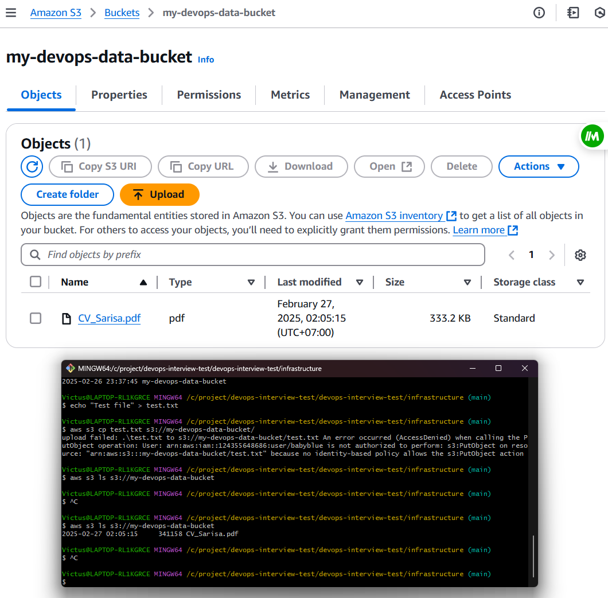
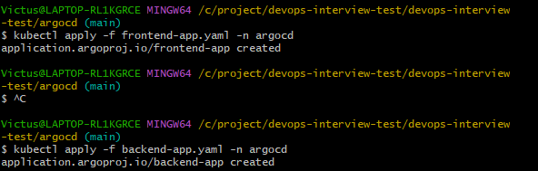
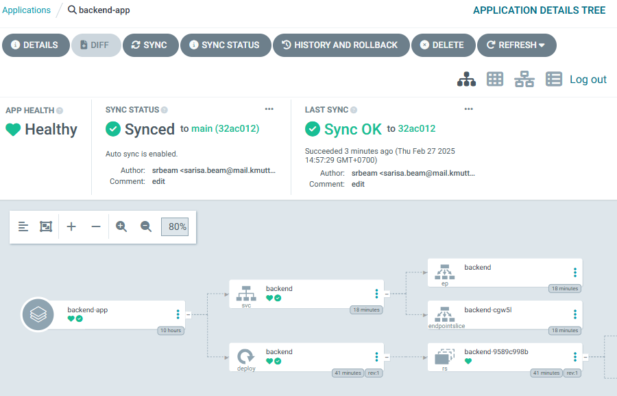
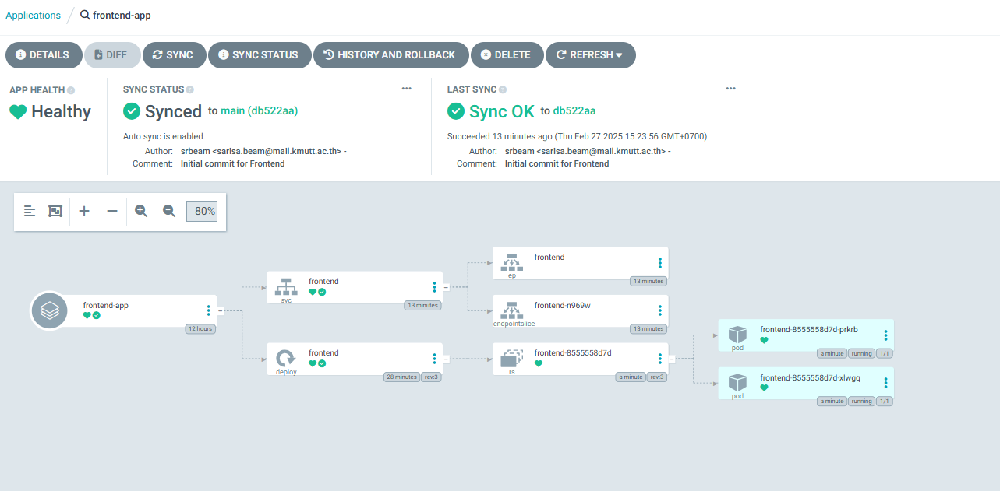

# devops-interview-test


## 1. Infrastructure as Code (IaC)

### Prerequisites
- [AWS CLI](https://aws.amazon.com/cli/)
- [Terraform](https://developer.hashicorp.com/terraform/downloads)
- [Kubectl](https://kubernetes.io/docs/tasks/tools/)
- [ArgoCD CLI](https://argo-cd.readthedocs.io/en/stable/cli_installation/)

### Step 1: VPC Setup
- Use [terraform-aws-modules](https://github.com/terraform-aws-modules) to create a **custom VPC**.
- Enable **VPC endpoints** for **EC2** and **S3** to ensure secure access.

```bash
terraform init
terraform apply -auto-approve
```

### Step 2: EKS Cluster Setup
- Deploy an **Amazon EKS** cluster using [terraform-aws-eks](https://github.com/terraform-aws-modules/terraform-aws-eks).

```bash
cd eks
terraform init
terraform apply -auto-approve
```

### Step 3: IAM Role for Service Accounts (IRSA)
- Create an **IAM Role for Service Accounts (IRSA)** to enable pod-level access to AWS resources such as S3.

```bash
kubectl annotate serviceaccount default \
    eks.amazonaws.com/role-arn=arn:aws:iam::123456789012:role/EKSIRSA
```

---

## 2. GitOps with Argo CD

### Step 4: Install Argo CD
- Deploy **Argo CD** within the EKS cluster.

```bash
kubectl create namespace argocd
kubectl apply -n argocd -f https://raw.githubusercontent.com/argoproj/argo-cd/stable/manifests/install.yaml
```

- Verify installation:
```bash
kubectl get pods -n argocd
```


### Step 5: Configure Argo CD Applications
- Create Argo CD applications for **frontend** and **backend** services.


```yaml
apiVersion: argoproj.io/v1alpha1
kind: Application
metadata:
  name: backend-app
  namespace: argocd
spec:
  destination:
    namespace: default
    server: https://kubernetes.default.svc
  source:
    repoURL: "https://github.com/your-org/backend.git"
    targetRevision: main
    path: manifests
  syncPolicy:
    automated:
      prune: true
      selfHeal: true
```

- Apply the manifest:
```bash
kubectl apply -f argocd/backend-app.yaml
```




---

## 3. CI/CD Pipeline (GitHub Actions)

### Step 6: Configure GitHub Actions

#### GitHub Secrets Configuration
Set the following secrets in your GitHub repository:
- `AWS_ACCESS_KEY_ID`
- `AWS_SECRET_ACCESS_KEY`
- `AWS_REGION`
- `AWS_ECR_REGISTRY`
- `AWS_ECR_REPOSITORY_BACKEND`
- `AWS_ECR_REPOSITORY_FRONTEND`

### Step 7: Create `.github/workflows/deploy.yml`

```yaml
name: Build and Deploy to Amazon ECR

on:
  push:
    tags:
      - 'v*'  # Triggers on versioned tags

jobs:
  build:
    runs-on: ubuntu-latest
    steps:
      - name: Checkout repository
        uses: actions/checkout@v3

      - name: Configure AWS credentials
        uses: aws-actions/configure-aws-credentials@v2
        with:
          aws-access-key-id: ${{ secrets.AWS_ACCESS_KEY_ID }}
          aws-secret-access-key: ${{ secrets.AWS_SECRET_ACCESS_KEY }}
          aws-region: ${{ secrets.AWS_REGION }}

      - name: Login to Amazon ECR
        uses: aws-actions/amazon-ecr-login@v1

      - name: Build and Push Docker Image to ECR
        env:
          AWS_ECR_REGISTRY: ${{ secrets.AWS_ECR_REGISTRY }}
          AWS_ECR_REPOSITORY: ${{ secrets.AWS_ECR_REPOSITORY_BACKEND }}
          VERSION: latest
        run: |
          docker build -t $AWS_ECR_REGISTRY/$AWS_ECR_REPOSITORY:$VERSION ./backend
          docker push $AWS_ECR_REGISTRY/$AWS_ECR_REPOSITORY:$VERSION
```

---

## 4. Testing & Deployment Validation

### Step 8: Verify the CI/CD Pipeline
- Push a new tag to trigger the GitHub Actions pipeline:
```bash
git tag v1.0.1
git push origin v1.0.1
```
- Monitor the pipeline in the GitHub Actions tab.

### Step 9: Validate Deployed Images in EKS
```bash
kubectl get deployments -n default
kubectl describe pod backend-app-xxxxx
```


